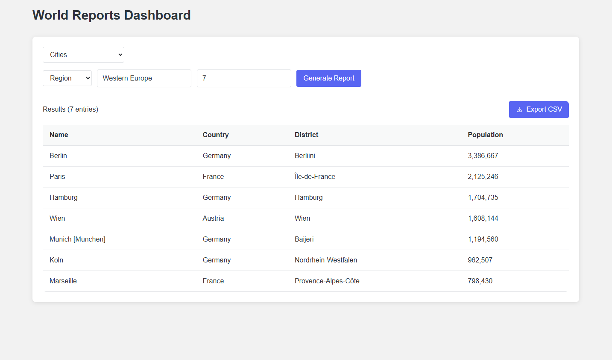

# **Population Information Reports**

  
  
[](https://github.com/Shvoruk/sqlreports/blob/master/LICENSE)  
[](https://github.com/Shvoruk/sqlreports/releases)  
[](https://app.codecov.io/github/Shvoruk/sqlreports)

This repository provides system to generate detailed population reports based on data from database. The project enables easy access to information about countries, cities, and languages, including their populations and demographics.

---

## **Live Application**

The system is available for use at:  
[**Population Reports Application**](https://population-reports-bhehbbbsd5fdche9.ukwest-01.azurewebsites.net/)

---

## **Features**
> 32 requirements of 32 have been implemented, which is 100%.

| **ID** | **Requirement Name**                                                                                                                   | **Met (Yes/No)** | **Screenshot**                        |
|--------|----------------------------------------------------------------------------------------------------------------------------------------|------------------|---------------------------------------|
| 1      | All the countries in the world organised by largest population to smallest.                                                            | Yes              |     |
| 2      | All the countries in a continent organised by largest population to smallest.                                                          | Yes              |   |
| 3      | All the countries in a region organised by largest population to smallest.                                                             | Yes              |   |
| 4      | The top `N` populated countries in the world where `N` is provided by the user.                                                        | Yes              |   |
| 5      | The top `N` populated countries in a continent where `N` is provided by the user.                                                      | Yes              |   |
| 6      | The top `N` populated countries in a region where `N` is provided by the user.                                                         | Yes              |   |
| 7      | All the cities in the world organised by largest population to smallest.                                                               | Yes              |   |
| 8      | All the cities in a continent organised by largest population to smallest.                                                             | Yes              |   |
| 9      | All the cities in a region organised by largest population to smallest.                                                                | Yes              |   |
| 10     | All the cities in a country organised by largest population to smallest.                                                               | Yes              |   |
| 11     | All the cities in a district organised by largest population to smallest.                                                              | Yes              |  |
| 12     | The top `N` populated cities in the world where `N` is provided by the user.                                                           | Yes              |  |
| 13     | The top `N` populated cities in a continent where `N` is provided by the user.                                                         | Yes              |  |
| 14     | The top `N` populated cities in a region where `N` is provided by the user.                                                            | Yes              |  |
| 15     | The top `N` populated cities in a country where `N` is provided by the user.                                                           | Yes              |  |
| 16     | The top `N` populated cities in a district where `N` is provided by the user.                                                          | Yes              |  |
| 17     | All the capital cities in the world organised by largest population to smallest.                                                       | Yes              |  |
| 18     | All the capital cities in a continent organised by largest population to smallest.                                                     | Yes              |  |
| 19     | All the capital cities in a region organised by largest to smallest.                                                                   | Yes              |  |
| 20     | The top `N` populated capital cities in the world  where `N` is provided by the user.                                                  | Yes              |  |
| 21     | The top `N` populated capital cities in a continent where `N` is provided by the user.                                                 | Yes              |  |
| 22     | The top `N` populated capital cities in a region where `N` is provided by the user.                                                    | Yes              |  |
| 23     | The population of people, people living in cities, and people not living in cities in each continent.                                  | Yes              |  |
| 24     | The population of people, people living in cities, and people not living in cities in each region.                                     | Yes              |  |
| 25     | The population of people, people living in cities, and people not living in cities in each country.                                    | Yes              |  |
| 26     | The population of the world.                                                                                                           | Yes              |  |
| 27     | The population of a continent.                                                                                                         | Yes              |  |
| 28     | The population of a region.                                                                                                            | Yes              |  |
| 29     | The population of a country.                                                                                                           | Yes              |  |
| 30     | The population of a district.                                                                                                          | Yes              |  |
| 31     | The population of a city.                                                                                                              | Yes              |  |
| 32     | Number of people who speak  the following languages from greatest number to smallest, including the percentage of the world population | Yes              |  |

---

## **Contribution Spreadsheet**

| Matriculation Number | Code Review 1 | Code Review 2 | Code Review 3 | Code Review 4 |
|----------------------|---------------|---------------|---------------|---------------|
| 40677981             | 20            | 20            | 20            | 20            |
| 40683200             | 20            | 20            | 20            | 20            |
| 40664387             | 25            | 25            | 25            | 25            |
| 40666960             | 35            | 35            | 35            | 35            |
| Total                | 100           | 100           | 100           | 100           |

---

### **Setup**

1. **Clone the Repository**:
   ```bash
   git clone https://github.com/Shvoruk/sqlreports.git
   cd sqlreports
   ```

2. **Run the Application**:
   Use Docker Compose to start the application:
   ```bash
   docker-compose up
   ```

3. **Access the Application**:
   Once the application is running, open your browser and navigate to:
   [http://localhost:8080](http://localhost:8080)

---

## **Contributing**

Contributions are welcome! To add a new report or improve existing scripts:

1. Fork the repository.
2. Create a new branch:
   ```bash
   git checkout -b feature/new-report
   ```
3. Add your changes and commit:
   ```bash
   git commit -m "Add new report for XYZ"
   ```
4. Push your branch and create a pull request.

---

## **Contact**
For any questions or feedback, please create an issue in the repository.
